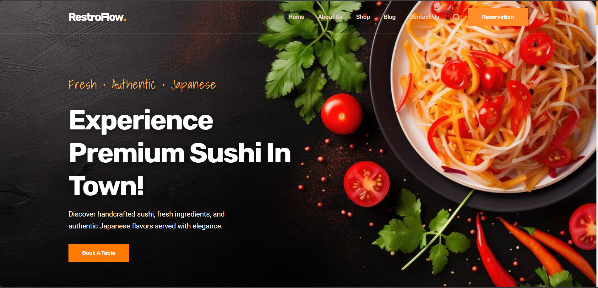

# RestroFlow – Premium Restaurant Website

RestroFlow is a modern and fully responsive restaurant website built using HTML, CSS, and JavaScript.

Designed for:
- Restaurants
- Cafés
- Sushi Bars
- Indian Food Restaurants
- Food Startups

---

## Features

- Fully Responsive Design
- Smooth Scrolling Navigation
- WhatsApp Table Booking
- WhatsApp Food Ordering
- Interactive Food Menu
- Search Functionality
- Modern UI Design
- Mobile Friendly
- Premium Footer Design
- Restaurant Hero Section

---

## Technologies Used

- HTML5
- CSS3
- JavaScript
- Ionicons

---

## Live Demo

https://tejasduratkar.github.io/restroflow-restro-website/

---

## Screenshots

### Homepage



---

## Run Locally

Clone the project:

```bash
git clone https://github.com/TEJASDURATKAR/restroflow-restro-website.git